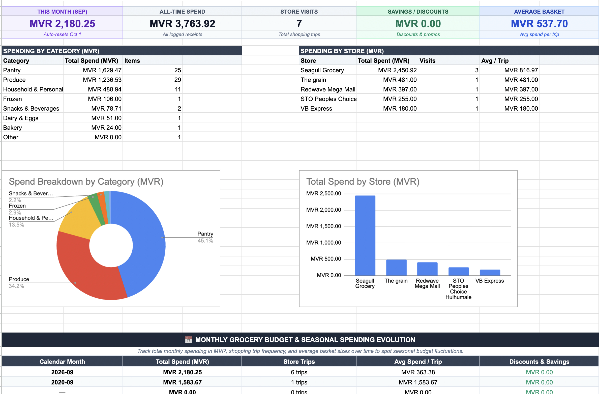
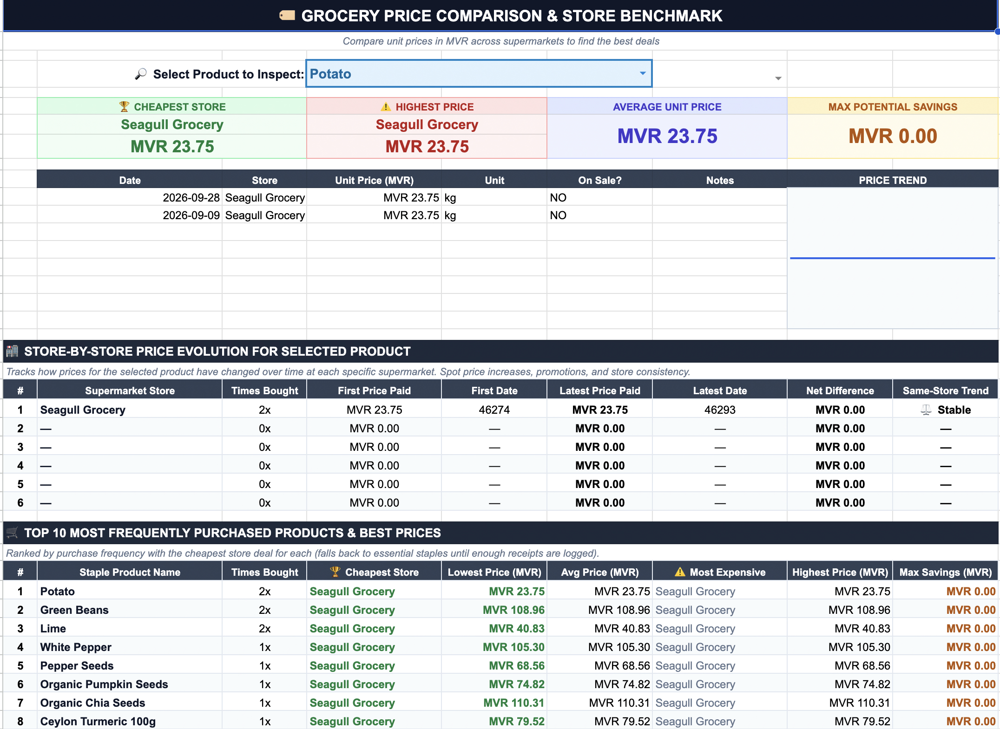
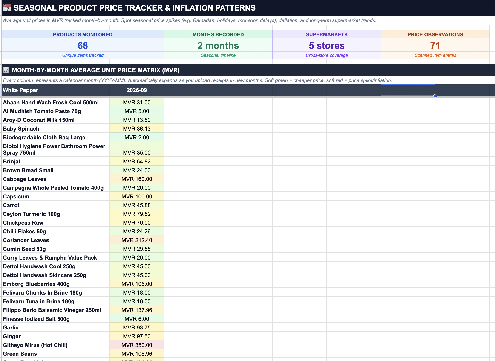
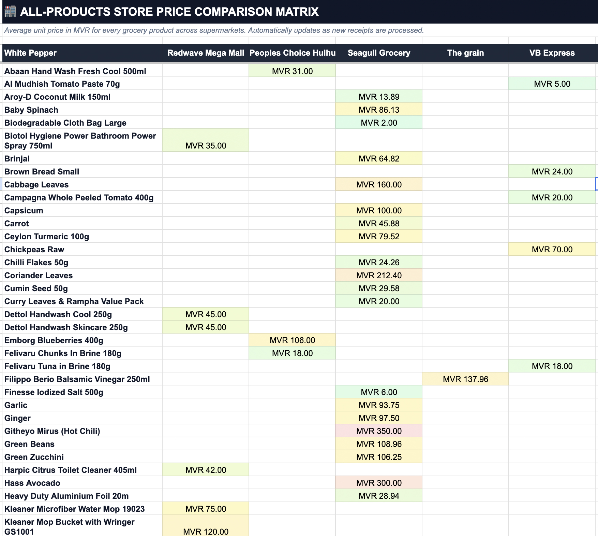
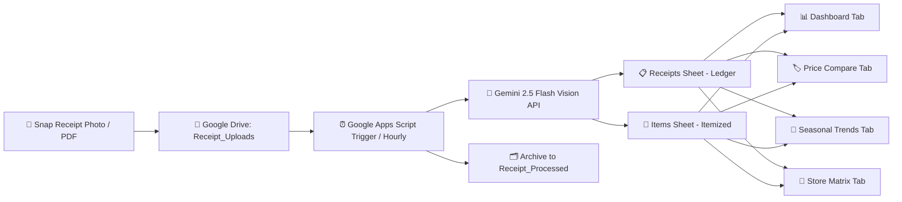

# 🧾 Automated Grocery Receipt Scraper & Price Tracker

> **Turn paper receipts into structured spreadsheets, spending analytics, and cross-store price comparisons in Google Sheets — powered by Google Drive and the free Gemini Multimodal AI API.**

[](https://developers.google.com/apps-script)
[](https://aistudio.google.com)
[](https://sheets.new)
[](LICENSE)
[](#-setup-guide-under-5-minutes)

---

## 💡 Why This Project Exists

> *"I created this project to make my life easier and keep track of grocery prices across different supermarkets. With prices fluctuating almost daily, I wanted a clear way to:*
> 1. *Find where the exact same product is sold cheaper.*
> 2. *Detect if a specific store quietly raised their prices over time.*
> 3. *Track seasonal price patterns (e.g. Ramadan surges, festive seasons, monsoon import delays).*
> 4. *Identify long-term inflation patterns as more receipt data accumulates over months and years.*
>
> *The entire system runs automatically in the background on free Google infrastructure without paying for third-party apps or subscriptions."*

---

## 📸 Screenshots Showcase

<!-- 
==============================================================================
📸 HOW TO ADD YOUR SCREENSHOTS:
Save your screenshots to `docs/screenshots/` with these exact filenames:
  - docs/screenshots/dashboard.png
  - docs/screenshots/price_compare.png
  - docs/screenshots/seasonal_trends.png
  - docs/screenshots/store_matrix.png
Once committed to GitHub, they will automatically display below!
==============================================================================
-->

### 1. 📊 Executive Spending & Monthly Budget Dashboard
*Track monthly budgets with auto-resetting cards, all-time spend, trip frequency, category donut charts, store column charts, and the **Monthly Spending Evolution Table**.*



---

### 2. 🏷️ Interactive Product Comparator & Store-by-Store Evolution
*Inspect any grocery product to reveal the cheapest store, most expensive store, price trend sparklines, and the **Store-by-Store Price Evolution Table** (showing whether a specific store raised, lowered, or maintained its price).*



---

### 3. 📅 Seasonal Product Price Tracker & Inflation Matrix
*Dynamic month-by-month grid (`YYYY-MM`) comparing unit prices for every grocery staple across time. Identifies seasonal price spikes (e.g. Ramadan, holidays) and long-term supermarket inflation.*



---

### 4. 🏬 Master Store Price Matrix
*Side-by-side supermarket price comparison grid with automatic color gradient highlighting the best deals across all stores.*



---

## ✨ Key Features

### 🛒 Cross-Store Price Intelligence
- **Cheapest vs. Most Expensive Store Cards**: Instantly shows the lowest and highest price recorded for any selected grocery item, along with potential savings.
- **Top 10 Frequently Purchased Staples**: Automatically ranks your most common purchases with instant deal comparisons and fallbacks to essential staples.
- **Master Store Matrix**: View every product side-by-side across all supermarkets in your area with soft green-to-red price heatmaps.

### 📈 Same-Store Price Tracking Over Time
- **Track Price Changes at the Same Store**: See whether Store A raised its price from MVR 20 to MVR 24, while Store B kept it at MVR 21.
- **First Price vs. Latest Price Paid**: Records the exact dates and unit prices of your first and most recent purchases at each supermarket.
- **Trend Indicators**: Displays clean trend badges (`🔺 +12.5%`, `🟢 -8.0%`, `⚖️ Stable`, `⚪ 1st Record`).

### 📅 Seasonal & Long-Term Pattern Detection
- **Month-by-Month Price Grid (`YYYY-MM`)**: Automatically pivots new months as receipts are uploaded.
- **Seasonal Fluctuation Tracking**: Observe how fresh produce, staples, and imported items surge during specific seasons (e.g. Ramadan, holiday feasts, rainy monsoon shipping delays) and normalize afterward.
- **Monthly Grocery Budget Evolution**: Month-over-month breakdown of total grocery spend, trip counts, average basket sizes, and promotional savings.

### 🤖 Hands-Free Multimodal Automation
- **Mobile Snap-and-Forget**: Snap receipts with your phone into Google Drive.
- **Gemini 2.5 Flash Multimodal Vision**: Extracts store name, transaction date, tax, fees, discounts, and itemized lines (standardized names, categories, quantities, unit prices).
- **Autonomous Hourly Trigger**: Wakes up every hour, parses new uploads, populates Google Sheets, and archives processed receipts.
- **100% Free & Self-Hosted**: Runs on the free tiers of Google AI Studio (1,500 requests/day), Google Drive, and Google Sheets. Your data never leaves your Google account.

---

## 🏗️ Architecture & Workflow



---

## 🚀 Setup Guide (Under 5 Minutes)

### Step 1: Get Your Free Gemini API Key
1. Visit [Google AI Studio (aistudio.google.com)](https://aistudio.google.com).
2. Sign in with your Google account.
3. Click **Get API key** > **Create API key in new project**.
4. Copy the generated key. *(The free tier includes 1,500 requests per day with zero billing required).*

---

### Step 2: Create a Google Sheet & Paste the Code
1. Open [Google Sheets](https://sheets.new) to create a blank spreadsheet (e.g., name it `Grocery Price Tracker`).
2. In the top navigation menu, open **Extensions** > **Apps Script**.
3. Clear out any default code in `Code.gs`.
4. Copy the entire contents of [`Code.gs`](Code.gs) from this repository and paste it into the editor.
5. Click the **Save** icon 💾 (or press `Cmd + S` / `Ctrl + S`).

---

### Step 3: Add Your API Key to Script Properties (Securely)
> [!IMPORTANT]
> Never hardcode your API key directly in script code. Use Google Apps Script's encrypted Script Properties storage.

1. In the Apps Script editor, click the **Project Settings** (gear icon ⚙️ on the left sidebar).
2. Scroll down to the **Script Properties** section and click **Add script property**.
3. Set:
   - **Property**: `GEMINI_API_KEY`
   - **Value**: *(Paste your Gemini API key from Step 1)*
4. Click **Save script properties**.

---

### Step 4: Run Initial Setup
1. Switch back to your Google Sheet and reload the page (`F5` or `Cmd + R`).
2. A new custom menu titled **🧾 Receipt Scraper** will appear in the top menu bar.
3. Click **🧾 Receipt Scraper** > **⚙️ Initialize Sheets & Drive Folders**.
4. **Grant Permissions**:
   - Google will display an *Authorization Required* pop-up on first execution.
   - Click **Review permissions** > Select your Google Account.
   - Click **Advanced** (bottom left) > **Go to Untitled project (unsafe)** > Click **Allow**.
5. Once complete, the script automatically creates:
   - 📁 **Google Drive Folders**: `Receipt_Uploads` and `Receipt_Processed`.
   - 📊 **Six Pre-Configured Tabs**:
     - `📊 Dashboard`: KPI cards, spending charts, and monthly budget evolution table.
     - `🏷️ Price Compare`: Interactive product inspector, cheapest/most expensive store cards, sparklines, store-by-store price evolution, and top 10 staples.
     - `📅 Seasonal & Price Trends`: Month-by-month product unit price matrix (`YYYY-MM`) with color-coded price spikes and inflation tracking.
     - `🏬 Store Matrix`: Cross-store supermarket comparison grid.
     - `Receipts`: Master transaction ledger (receipt IDs, dates, taxes, totals).
     - `Items`: Itemized line items ledger (standard names, categories, quantities, unit prices).

---

### Step 5: Enable Automatic Background Processing
In your Google Sheet menu:
- Click **🧾 Receipt Scraper** > **⏰ Enable Hourly Auto-Scraper Trigger**.
- Apps Script will now autonomously scan `Receipt_Uploads` every hour, process new receipts, and archive them.

*(You can also click **▶️ Process Pending Receipts Now** anytime to run a scan immediately).*

---

## 📱 Mobile Workflow (Capture on the Go)

1. Install the official **Google Drive** app on your phone ([iOS](https://apps.apple.com/app/google-drive/id507874739) / [Android](https://play.google.com/store/apps/details?id=com.google.android.apps.docs)).
2. Locate the folder named `Receipt_Uploads` created in Step 4.
3. **Pro Tip**: Star the folder or add a 1-tap widget / shortcut to your home screen.
4. After shopping:
   - Snap a photo or share the digital receipt / PDF into `Receipt_Uploads`.
5. The scheduled trigger processes and archives the receipt automatically!

---

## ⚙️ Configuration & Customization

All primary settings are located at the top of [`Code.gs`](Code.gs) in the `CONFIG` object:

```javascript
const CONFIG = {
  // Folder Names in your Google Drive
  UPLOAD_FOLDER_NAME: 'Receipt_Uploads',
  PROCESSED_FOLDER_NAME: 'Receipt_Processed',

  // Sheet Tab Names
  SHEET_RECEIPTS: 'Receipts',
  SHEET_ITEMS: 'Items',
  SHEET_DASHBOARD: '📊 Dashboard',
  SHEET_PRICE_COMPARE: '🏷️ Price Compare',
  SHEET_PRICE_TRENDS: '📅 Seasonal & Price Trends',
  SHEET_STORE_MATRIX: '🏬 Store Matrix',

  // Currency Settings (Defaults to MVR - Maldivian Rufiyaa, customizable for any country)
  CURRENCY_CODE: 'MVR',
  CURRENCY_FORMAT: '"MVR "#,##0.00',

  // Gemini AI Model (Google AI Studio Free Tier)
  GEMINI_MODEL: 'gemini-2.5-flash',

  // Batch limit to prevent script timeouts
  MAX_FILES_PER_RUN: 5
};
```

### 💱 Changing Currency
The default currency is **MVR (Maldivian Rufiyaa)**. If you shop in a different currency, simply update `CURRENCY_CODE` and `CURRENCY_FORMAT` at the top of `Code.gs`:

| Currency | `CURRENCY_CODE` | `CURRENCY_FORMAT` |
| :--- | :--- | :--- |
| **Maldivian Rufiyaa (MVR)** *(Default)* | `'MVR'` | `'"MVR "#,##0.00'` |
| **US Dollar ($)** | `'USD'` | `'"$"#,##0.00'` |
| **Euro (€)** | `'EUR'` | `'"€"#,##0.00'` |
| **British Pound (£)** | `'GBP'` | `'"£"#,##0.00'` |
| **Canadian Dollar ($)** | `'CAD'` | `'"$"#,##0.00'` |
| **Australian Dollar ($)** | `'AUD'` | `'"$"#,##0.00'` |
| **Indian Rupee (₹)** | `'INR'` | `'"₹"#,##0.00'` |

*After editing, click **🧾 Receipt Scraper** > **📊 Build / Refresh Dashboards** to update all existing charts and metric cards.*

---

## 🛠️ Diagnostics & Built-in Utilities

The custom menu includes diagnostic tools:

- **🔍 Run Diagnostics & Check Status**: Verifies that your `GEMINI_API_KEY` is active, checks Drive folders, inspects pending files, and checks whether all dashboard tabs and hourly triggers are active.
- **📋 List Available Gemini Models**: Queries the Gemini API to list all active vision models supported by your API key.
- **📊 Build / Refresh Dashboards**: Re-generates formulas, formatting, and charts without affecting your raw scanned data.
- **⏹️ Disable Hourly Auto-Scraper Trigger**: Removes the background trigger if you prefer strictly manual processing.

---

## 📂 Repository Structure

```text
├── Code.gs                   # Core Google Apps Script implementation
├── README.md                 # Complete documentation & setup instructions
├── LICENSE                   # MIT Open Source License
├── .gitignore                # Git exclusions (OS files, editor settings, local logs)
└── docs/
    └── screenshots/          # Folder for README preview images
        ├── README.md         # Guide on screenshot dimensions & filenames
        ├── dashboard.png     # (Place your Spending Dashboard screenshot here)
        ├── price_compare.png # (Place your Price Compare tab screenshot here)
        ├── seasonal_trends.png# (Place your Seasonal Trends tab screenshot here)
        └── store_matrix.png  # (Place your Store Matrix screenshot here)
```

---

## 🔒 Privacy & Security

- **No Third-Party Access**: This project operates strictly between your personal Google account and Google AI Studio.
- **Zero Data Leakage**: Your receipts and spreadsheet data are never forwarded to any third-party analytics, hosting services, or external databases.
- **Key Safety**: Your Gemini API key is stored securely in your Google Apps Script project's encrypted `ScriptProperties` store, not in your code or spreadsheet cells.

---

## 🤝 Contributing

Contributions, feedback, and feature requests are welcome!
1. Fork the repository.
2. Create a feature branch (`git checkout -b feature/my-feature`).
3. Commit your changes (`git commit -m 'Add awesome feature'`).
4. Push to your branch (`git push origin feature/my-feature`).
5. Open a Pull Request.

---

## 📄 License

This project is licensed under the [MIT License](LICENSE) — free for personal and commercial use.
