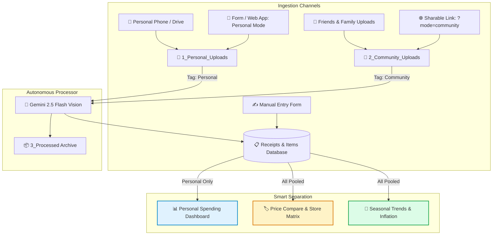

# 🧾 Automated Grocery Receipt Scraper & Price Tracker

> **Turn paper receipts into structured spreadsheets, spending analytics, and cross-store price comparisons in Google Sheets — powered by Google Drive and the free Gemini Multimodal AI API.**

[](https://developers.google.com/apps-script)
[](https://aistudio.google.com)
[](https://sheets.new)
[](LICENSE)
[](#-setup-guide-under-5-minutes)

---

## 💡 Why This Project Exists

> *"I built this project to solve a personal frustration: keeping track of grocery prices across different supermarkets. With the current economic situation in the Maldives causing prices to fluctuate almost daily, I needed a reliable and clear way to compare costs and make smarter shopping decisions. The goal is to:*
> 1. *Find where the exact same product is sold cheaper.*
> 2. *Detect if a specific store quietly raised its prices over time.*
> 3. *Track seasonal price patterns (e.g., Ramadan surges, festive seasons, monsoon import delays).*
> 4. *Identify long-term inflation patterns as more receipt data accumulates over months and years.*
>
> *The entire system runs automatically in the background on free Google infrastructure without paying for third-party apps or subscriptions."*

---

## 📸 Screenshots Showcase

<!-- 
==============================================================================
📸 HOW TO ADD YOUR SCREENSHOTS:
Save your screenshots to `docs/screenshots/` with these exact filenames:
  - docs/screenshots/dashboard.png
  - docs/screenshots/price_compare.png
  - docs/screenshots/seasonal_trends.png
  - docs/screenshots/store_matrix.png
Once committed to GitHub, they will automatically display below!
==============================================================================
-->

### 1. 📊 Executive Spending & Monthly Budget Dashboard
*Track monthly budgets with auto-resetting cards, all-time spend, trip frequency, category donut charts, store column charts, and the **Monthly Spending Evolution Table**.*


---

### 2. 🏷️ Interactive Product Comparator & Store-by-Store Evolution
*Inspect any grocery product to reveal the cheapest store, most expensive store, price trend sparklines, and the **Store-by-Store Price Evolution Table** (showing whether a specific store raised, lowered, or maintained its price).*


---

### 3. 📅 Seasonal Product Price Tracker & Inflation Matrix
*Dynamic month-by-month grid (`YYYY-MM`) comparing unit prices for every grocery staple across time. Identifies seasonal price spikes (e.g. Ramadan, holidays) and long-term supermarket inflation.*


---

### 4. 🏬 Master Store Price Matrix
*Side-by-side supermarket price comparison grid with automatic color gradient highlighting the best deals across all stores.*


---

### 5. 📱 Mobile Receipt & Manual Price Entry Form
*Responsive Web App and Google Sheets dialog for instant camera photo uploads with AI extraction, manual grocery logging without receipts, and safe locked sharing with friends & family.*


---

## ✨ Key Features

### 🛒 Cross-Store Price Intelligence
- **Cheapest vs. Most Expensive Store Cards**: Instantly shows the lowest and highest price recorded for any selected grocery item, along with potential savings.
- **Top 10 Frequently Purchased Staples**: Automatically ranks your most common purchases with instant deal comparisons and fallbacks to essential staples.
- **Master Store Matrix**: View every product side-by-side across all supermarkets in your area with soft green-to-red price heatmaps.

### 📈 Same-Store Price Tracking Over Time
- **Track Price Changes at the Same Store**: See whether Store A raised its price from MVR 20 to MVR 24, while Store B kept it at MVR 21.
- **First Price vs. Latest Price Paid**: Records the exact dates and unit prices of your first and most recent purchases at each supermarket.
- **Trend Indicators**: Displays clean trend badges (`🔺 +12.5%`, `🟢 -8.0%`, `⚖️ Stable`, `⚪ 1st Record`).

### 📅 Seasonal & Long-Term Pattern Detection
- **Month-by-Month Price Grid (`YYYY-MM`)**: Automatically pivots new months as receipts are uploaded.
- **Seasonal Fluctuation Tracking**: Observe how fresh produce, staples, and imported items surge during specific seasons (e.g. Ramadan, holiday feasts, rainy monsoon shipping delays) and normalize afterward.
- **Monthly Grocery Budget Evolution**: Month-over-month breakdown of total grocery spend, trip counts, average basket sizes, and promotional savings.

### 🤖 Hands-Free Multimodal Automation
- **Mobile Snap-and-Forget**: Snap receipts with your phone into Google Drive or submit via the Form Web App.
- **Gemini 2.5 Flash Multimodal Vision**: Extracts store name, transaction date, tax, fees, discounts, and itemized lines (standardized names, categories, quantities, unit prices).
- **Autonomous Hourly Trigger**: Wakes up every hour, parses new uploads, populates Google Sheets, and archives processed receipts.
- **100% Free & Self-Hosted**: Runs on the free tiers of Google AI Studio (1,500 requests/day), Google Drive, and Google Sheets. Your data never leaves your Google account.

### 👥 Friends & Family Price Comparison (Zero Budget Contamination)
- **Isolated Personal Finances**: Friends and family receipts are tagged as `Community` and completely excluded from your personal spending KPIs and monthly budget cards.
- **Crowdsourced Price Deals**: All items across both `Personal` and `Community` receipts are pooled into the `🏷️ Price Compare`, `🏬 Store Matrix`, and `📅 Seasonal Trends` tabs to give you unbeatable store price discovery.

### 📱 Responsive Web App & Manual Entry Form
- **📷 Instant Photo Upload**: Snap or upload receipts directly on mobile browser or desktop with immediate AI extraction.
- **✍️ Manual Entry Mode (No Receipt)**: Bought groceries at a local market with no paper receipt? Enter the store, date, and multiple items dynamically (`+ Add Item`).
- **🔒 Context-Locked Link (`?mode=community`)**: Share a link with friends on WhatsApp or Viber that permanently locks into Community mode so they cannot accidentally affect your personal budget.

### 🇲🇻 Government Price Benchmarking & Store Leaderboard (Agumagu)
- **Direct Official Integration**: Pulls live surveillance quotes directly from the Maldivian Ministry of Economic Development & Trade open API ([agumagu.trade.gov.mv](https://agumagu.trade.gov.mv/)).
- **Two-Sheet System**:
  - `🇲🇻 Gov Price Data`: Stores all 14,000+ recent verified store-level quotes (Date, Commodity, Store, Island, Price, Gov Base, Diff, Stock Level, Brand) sorted newest date first.
  - `🇲🇻 Gov Price Dashboard`: Interactive dashboard with commodity dropdown selector, 4 KPI cards (Gov Base, Malé Lowest, National Lowest, Market Average), and dynamic Store-by-Store Price Leaderboard automatically sorted from cheapest to most expensive.
- **Automatic Drive CSV Snapshots**: Saves timestamped archives to `Receipt_Scraper/4_Gov_Price_Archives/agumagu_prices_YYYY-MM-DD.csv` in Google Drive on every sync.
- **Automated Daily Background Trigger**: Refreshes quotes automatically every morning at 07:00 AM MVT.
- **Receipt Price Audit Modal**: One-click audit (`🔍 Double-Check Receipts vs Gov Benchmarks`) matching your scanned receipt items with official commodities, flagging overpayments, fair market rates, and great deals with exact MVR variances.

---

## 🏗️ Architecture & Workflow



---

## 🚀 Setup Guide (Under 5 Minutes)

### Step 1: Get Your Free Gemini API Key
1. Visit [Google AI Studio (aistudio.google.com)](https://aistudio.google.com).
2. Sign in with your Google account.
3. Click **Get API key** > **Create API key in new project**.
4. Copy the generated key. *(The free tier includes 1,500 requests per day with zero billing required).*

---

### Step 2: Create a Google Sheet & Paste the Code
1. Open [Google Sheets](https://sheets.new) to create a blank spreadsheet (e.g., name it `Grocery Price Tracker`).
2. In the top navigation menu, open **Extensions** > **Apps Script**.
3. Clear out any default code in `Code.gs`.
4. Copy the entire contents of [`Code.gs`](Code.gs) from this repository and paste it into `Code.gs`.
5. Click the **`+`** icon next to *Files* on the left sidebar > select **Script** > name it `Agumagu` (so it becomes `Agumagu.gs`).
6. Copy the entire contents of [`Agumagu.gs`](Agumagu.gs) from this repository and paste it into `Agumagu.gs`.
7. Click the **`+`** icon next to *Files* > select **HTML** > name it `Form` (so it becomes `Form.html`).
8. Copy the entire contents of [`Form.html`](Form.html) from this repository and paste it into `Form.html`.
9. Click the **Save** icon 💾 (or press `Cmd + S` / `Ctrl + S`).

---

### Step 3: Add Your API Key to Script Properties (Securely)
> [!IMPORTANT]
> Never hardcode your API key directly in script code. Use Google Apps Script's encrypted Script Properties storage.

1. In the Apps Script editor, click the **Project Settings** (gear icon ⚙️ on the left sidebar).
2. Scroll down to the **Script Properties** section and click **Add script property**.
3. Set:
   - **Property**: `GEMINI_API_KEY`
   - **Value**: *(Paste your Gemini API key from Step 1)*
4. Click **Save script properties**.

---

### Step 4: Run Initial Setup
1. Switch back to your Google Sheet and reload the page (`F5` or `Cmd + R`).
2. A new custom menu titled **🧾 Receipt Scraper** will appear in the top menu bar.
3. Click **🧾 Receipt Scraper** > **⚙️ Initialize Sheets & Drive Folders**.
4. **Grant Permissions**:
   - Google will display an *Authorization Required* pop-up on first execution.
   - Click **Review permissions** > Select your Google Account.
   - Click **Advanced** (bottom left) > **Go to Untitled project (unsafe)** > Click **Allow**.
5. Once complete, the script automatically creates:
   - 📁 **Organized Google Drive Folder**: `Receipt_Scraper` containing:
     - `1_Personal_Uploads/` — Drop your receipts here.
     - `2_Community_Uploads/` — Friends and family receipts go here.
     - `3_Processed/` — Completed receipts are archived here.
   - 📊 **Six Pre-Configured Tabs** with `Source` tracking:
     - `📊 Dashboard`: KPI cards (Monthly Spend, All-Time Spend, Trips, Savings) strictly isolated to your **Personal** receipts.
     - `🏷️ Price Compare`: Interactive product inspector, cheapest/most expensive store cards, sparklines, store-by-store price evolution, and top 10 staples (pooling **both Personal and Community** records).
     - `📅 Seasonal & Price Trends`: Month-by-month product unit price matrix (`YYYY-MM`) with color-coded price spikes and inflation tracking.
     - `🏬 Store Matrix`: Cross-store supermarket comparison grid across all stores.
     - `Receipts`: Master transaction ledger with `Source` column.
     - `Items`: Itemized line items ledger with `Source` column.

---

### Step 5: Deploy the Mobile Web App & Get Sharable Links
Deploying as a Web App gives you a mobile-friendly link for your phone and a locked community link for friends and family:

1. In the Apps Script editor, click the blue **Deploy** button (top right) > **New deployment**.
2. Click the gear icon ⚙️ next to *Select type* > select **Web app**.
3. Fill in the deployment details:
   - **Description**: `Receipt Scraper & Price Tracker`
   - **Execute as**: **Me (`your-email@gmail.com`)**
   - **Who has access**: **Anyone**
     > [!TIP]
     > Setting **Who has access** to **Anyone** is critical: it prevents Google's multi-account login conflicts and allows friends/family to submit receipts without permission errors.
4. Click **Deploy**. (Authorize permissions if prompted).
5. In the deployment popup, copy the **Web app URL** under the *Web app* section (it starts with `https://script.google.com/macros/s/AKfycb.../exec`).

#### How to Use Your Links:
- 👤 **Your Master Mobile App**: Bookmark the copied URL on your iPhone/Android or tap *"Add to Home Screen"* to open it as a full-screen app on the go!
- 👥 **Friends & Family Link**: Add `?mode=community` to the end of that same URL and share it on WhatsApp/Viber:
  ```text
  https://script.google.com/macros/s/AKfycbXXXXXXXXXXXXXXXXXXXXXXXXXXXXX/exec?mode=community
  ```
  *(This permanently locks the form into Community mode so friends can contribute prices without ever seeing or altering your personal budget).*
- 💻 **Inside Google Sheets**: You can also open the form directly anytime by clicking **`🧾 Receipt Scraper`** > **`📝 Open Receipt & Grocery Form`**.

---

### Step 6: Enable Automatic Background Processing
In your Google Sheet menu:
- Click **🧾 Receipt Scraper** > **⏰ Enable Hourly Auto-Scraper Trigger**.
- Apps Script will now autonomously scan both `1_Personal_Uploads` and `2_Community_Uploads` every hour, process new receipts, and archive them.

*(You can also click **▶️ Process Pending Receipts Now** anytime to run a scan immediately).*

---

## 📱 Mobile Workflow (Capture on the Go)

### Method A: Mobile Web App (Easiest)
1. Open the Web App URL from Step 5 on your iPhone or Android phone.
2. Tap "Add to Home Screen" to install it like a native app.
3. Switch between **📷 Upload Receipt Photo** (uses phone camera) or **✍️ Manual Entry (No Receipt)**.

### Method B: Google Drive Mobile App
1. Install the official **Google Drive** app on your phone.
2. Locate the folder `Receipt_Scraper` > `1_Personal_Uploads` (or `2_Community_Uploads`).
3. Snap or drop receipt photos into the respective folder.

---

## ⚙️ Configuration & Customization

All primary settings are located at the top of [`Code.gs`](Code.gs) in the `CONFIG` object:

```javascript
const CONFIG = {
  // Master Google Drive Folder Structure (nested in one root folder)
  PARENT_FOLDER_NAME: 'Receipt_Scraper',
  PERSONAL_UPLOAD_FOLDER_NAME: '1_Personal_Uploads',
  COMMUNITY_UPLOAD_FOLDER_NAME: '2_Community_Uploads',
  PROCESSED_FOLDER_NAME: '3_Processed',
  GOV_ARCHIVES_FOLDER_NAME: '4_Gov_Price_Archives',

  // Sheet Tab Names
  SHEET_RECEIPTS: 'Receipts',
  SHEET_ITEMS: 'Items',
  SHEET_DASHBOARD: '📊 Dashboard',
  SHEET_PRICE_COMPARE: '🏷️ Price Compare',
  SHEET_PRICE_TRENDS: '📅 Seasonal & Price Trends',
  SHEET_STORE_MATRIX: '🏬 Store Matrix',
  SHEET_AGUMAGU_DASHBOARD: '🇲🇻 Gov Price Dashboard',
  SHEET_AGUMAGU_DATA: '🇲🇻 Gov Price Data',

  // Currency Settings (Defaults to MVR - Maldivian Rufiyaa, customizable for any country)
  CURRENCY_CODE: 'MVR',
  CURRENCY_FORMAT: '"MVR "#,##0.00',

  // Gemini AI Model (Google AI Studio Free Tier)
  GEMINI_MODEL: 'gemini-2.5-flash',

  // Batch limit to prevent script timeouts
  MAX_FILES_PER_RUN: 5
};
```

### 💱 Changing Currency
The default currency is **MVR (Maldivian Rufiyaa)**. If you shop in a different currency, simply update `CURRENCY_CODE` and `CURRENCY_FORMAT` at the top of `Code.gs`:

| Currency | `CURRENCY_CODE` | `CURRENCY_FORMAT` |
| :--- | :--- | :--- |
| **Maldivian Rufiyaa (MVR)** *(Default)* | `'MVR'` | `'"MVR "#,##0.00'` |
| **US Dollar ($)** | `'USD'` | `'"$"#,##0.00'` |
| **Euro (€)** | `'EUR'` | `'"€"#,##0.00'` |
| **British Pound (£)** | `'GBP'` | `'"£"#,##0.00'` |
| **Canadian Dollar ($)** | `'CAD'` | `'"$"#,##0.00'` |
| **Australian Dollar ($)** | `'AUD'` | `'"$"#,##0.00'` |
| **Indian Rupee (₹)** | `'INR'` | `'"₹"#,##0.00'` |

*After editing, click **🧾 Receipt Scraper** > **📊 Build / Refresh Dashboards** to update all existing charts and metric cards.*

---

## 🛠️ Diagnostics & Built-in Utilities

The custom menu includes diagnostic tools:

- **🔍 Run Diagnostics & Check Status**: Verifies that your `GEMINI_API_KEY` is active, checks Drive folders, inspects pending files, and checks whether all dashboard tabs and hourly triggers are active.
- **📋 List Available Gemini Models**: Queries the Gemini API to list all active vision models supported by your API key.
- **📊 Build / Refresh Dashboards**: Re-generates formulas, formatting, and charts without affecting your raw scanned data.
- **⏹️ Disable Hourly Auto-Scraper Trigger**: Removes the background trigger if you prefer strictly manual processing.

---

## 📂 Repository Structure

```text
├── Code.gs                   # Core Google Apps Script implementation
├── Agumagu.gs                # Official Gov price scraper, daily trigger & receipt price audit
├── Form.html                 # Responsive Web App & Dialog UI for mobile/desktop entry
├── README.md                 # Complete documentation & setup instructions
├── LICENSE                   # MIT Open Source License
├── .gitignore                # Git exclusions (OS files, editor settings, local logs)
└── docs/
    └── screenshots/          # Folder for README preview images
        ├── README.md         # Guide on screenshot dimensions & filenames
        ├── dashboard.png     # Executive Spending Dashboard
        ├── price_compare.png # Price Comparison & Same-Store Price Evolution
        ├── seasonal_trends.png# Seasonal & Inflation Tracking
        ├── store_matrix.png  # Supermarket Matrix
        └── form.png          # Mobile & Desktop Receipt Entry Form
```

---

## ❓ Troubleshooting & FAQs

### Q: I opened the Web App link and got "Sorry, unable to open the file at this time. Get stuff done with Google Drive..."
**A:** This is a Google Drive permission and routing issue. Follow these 3 checks:
1. **Did you copy the right URL?** Make sure you copied the Web App URL that starts with `https://script.google.com/macros/s/AKfycb.../exec` from **Deploy > Manage deployments > Web app URL**, rather than the internal project ID or `/dev` URL.
2. **Access set to "Anyone"**: In Apps Script, click **Deploy > Manage deployments > Edit ✏️**, verify that **Who has access** is set to **Anyone**, change **Version** to **New version**, and click **Deploy**.
3. **Multiple Google Accounts**: If you are signed into multiple Google accounts in the same browser, open the link in an **Incognito / Private tab** or on your mobile phone browser.

### Q: Can I use the form directly on my computer without opening a browser link?
**A:** **Yes!** In your Google Sheet, simply click **`🧾 Receipt Scraper`** > **`📝 Open Receipt & Grocery Form`**. The form opens directly inside your spreadsheet as a popup dialog.

### Q: Will friends & family receipts affect my personal monthly grocery budget?
**A:** **No.** All personal expense scorecards, monthly spending history, and budget charts on the `📊 Dashboard` tab strictly filter by `Source = "Personal"`. Contributed receipts from friends and family are tagged as `Community` and are only used to populate the `🏷️ Price Compare`, `🏬 Store Matrix`, and `📅 Seasonal Trends` tabs.

### Q: What if I bought groceries at a local market with no paper receipt?
**A:** Open the form (on your phone or inside Google Sheets) and click the **`✍️ Manual Entry (No Receipt)`** tab. Enter the date, store name, and add your items dynamically using the **`➕ Add Item`** button. The script logs them directly into your database without needing an AI vision scan.

---

## 🔒 Privacy & Security

- **No Third-Party Access**: This project operates strictly between your personal Google account and Google AI Studio.
- **Zero Data Leakage**: Your receipts and spreadsheet data are never forwarded to any third-party analytics, hosting services, or external databases.
- **Key Safety**: Your Gemini API key is stored securely in your Google Apps Script project's encrypted `ScriptProperties` store, not in your code or spreadsheet cells.

---

## 🤝 Contributing

Contributions, feedback, and feature requests are welcome!
1. Fork the repository.
2. Create a feature branch (`git checkout -b feature/my-feature`).
3. Commit your changes (`git commit -m 'Add awesome feature'`).
4. Push to your branch (`git push origin feature/my-feature`).
5. Open a Pull Request.

---

## 📄 License

This project is licensed under the [MIT License](LICENSE) — free for personal and commercial use.
